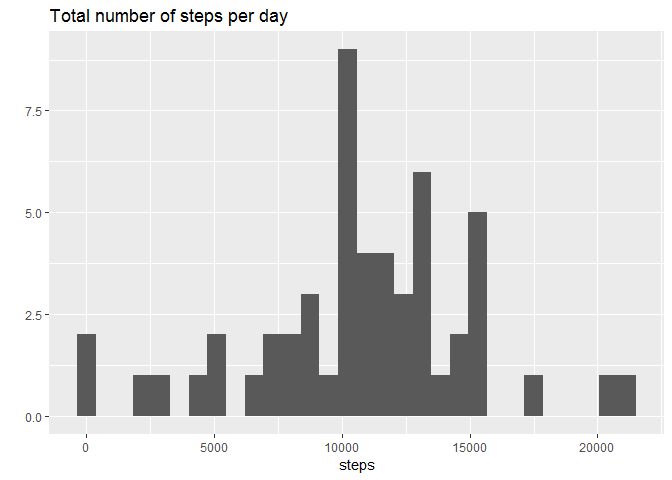
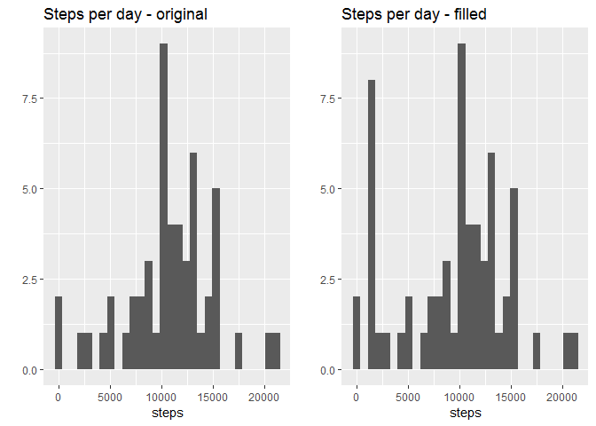

In thi assignment I make use of data from a personal activity monitoring
device. This device collects data at 5 minute intervals through out the
day. The data consists of two months of data from an anonymous
individual collected during the months of October and November, 2012 and
include the number of steps taken in 5 minute intervals each day.

    library(dplyr)
    library(ggplot2)
    library(gridExtra)
    library(lubridate)

Loading and preprocessing the data
----------------------------------

First of all I need to load the file.csv with data and store it in a
variable names "activity""

    if(!file.exists('activity.csv')){
        unzip('activity.zip')
    }
    activity <- read.csv("activity.csv")

In the following histogram we can see the total numer of steps taken per
day

    act_na <- filter(activity, !is.na(steps))
    activity_sum <- act_na %>% group_by(date) %>% summarize(st_tot= sum(steps))
    qplot(st_tot, data=activity_sum, bins=30, main="Total number of steps per day", xlab="steps")

    mean_steps <- round(mean(activity_sum$st_tot), digits = 2)
    median_steps <- median(activity_sum$st_tot)

The mean the median of steps per day is respectively 1.07661910^{4} and
10765.

Considering the 5-minute interval (x-axis) and the average number of
steps taken, averaged across all days (y-axis) we can see the average
daily activity pattern.

    activity_interval <- act_na %>% group_by(interval) %>% summarize(st_mean= mean(steps))
    interval_max <- activity_interval%>%filter(st_mean == max(st_mean))%>%select(1)
    p1 <- ggplot(activity_interval, aes(x = interval , y = st_mean))
    p1+geom_line(color="blue", size=1) + labs(title = "Avg. Daily Steps", x = "Interval", y = "Avg. Steps per day")

 The
5-minute interval with most steps on average across all the days is 835.

Imputing missing values
-----------------------

    row_na <- nrow(activity)-nrow(act_na)
    row_na <- nrow(activity)-nrow(act_na)
    x<-activity %>% group_by(date) %>% summarize(tot_steps = sum(steps)) %>% filter(is.na(tot_steps))
    day_na <- nrow(x)

In this database there are 2304 row with null value as steps and 8 dayes
with no data for steps. Now we will fill the NA value for 2304 row with
the median of steps fot the specific 5-minutes interval so we can create
a new database without null value in steps column

    data_fill <- act_na %>% group_by(interval) %>% summarize(st_median = median(steps))
    act_fill <- activity %>% filter(is.na(steps)) %>% merge(data_fill) %>% select(-steps) %>% rename(steps =st_median)
    #create a new db filling NA value
    activity_fill <- bind_rows(act_fill,act_na)

With this new dataset we can make again the histogram with the the total
numer of steps taken per day and chack if somethings will change.

    activity_sum2 <- activity_fill %>% group_by(date) %>% summarize(st_tot= sum(steps))
    require(gridExtra)
    plot1<-qplot(st_tot, data=activity_sum, bins=30, main="Steps per day - original", xlab="steps")
    plot2<-qplot(st_tot, data=activity_sum2, bins=30, main="Steps per day - filled", xlab="steps")
    grid.arrange(plot1, plot2, ncol=2)

    mean_steps2 <- round(mean(activity_sum2$st_tot), digits = 2)
    median_steps2 <- median(activity_sum2$st_tot)

Look at new median and mean: -mean total number of steps taken per day =
1.07661910^{4} -median total number of steps taken per day = 10765 We
can see that there are some differences using the median do fill the
null valune of steps, also the mean and median appears to be affected by
this simple data imputation, theis value are less.

Are there differences in activity patterns between weekdays and weekends?
-------------------------------------------------------------------------

We use the dataset with the filled-in missing values for this part. we
want to see if there is a different behavior between the weekdays the
weekend. For this reason we create a new factor variable in the dataset
with two levels ("Weekday" and "Weekend") indicating whether a given
date is a weekday or weekend day.

    activity_fill$dayofweek <- weekdays(as.Date(activity_fill$date))
    activity_fill$weekend <-as.factor(activity_fill$dayofweek=="sabato"|activity_fill$dayofweek=="domenica")
    levels(activity_fill$weekend) <- c("Weekday", "Weekend")
    act_week <- activity_fill %>% group_by(interval, weekend) %>% summarize(st_mean= mean(steps))
    ggplot(act_week, aes(x = interval , y = st_mean)) + geom_line(color="blue", size=1) + labs(title = "Avg. Daily Steps by Weektype", x = "Interval", y = "No. of Steps") + facet_wrap(~weekend , ncol = 1, nrow=2)

From the graph we can see that during the weekend the number of steps is
higher in the middle of the day
